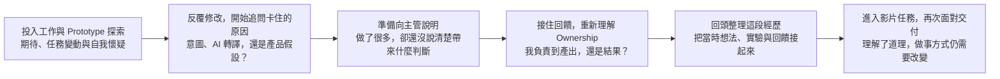

### Hi, I'm William Chiu

資管系畢業生，喜歡把想法做成真的東西。

---

## 🚀 Projects

| 專案 | 描述 | 技術 |
|------|------|------|
| [ESG RAG Query System](https://github.com/WilliamCHIU-ETH/esg-rag-query-system) | 企業 ESG 報告 RAG 查詢系統，支援自然語言問答 | Python · RAG · LLM |
| [VR Vocational Training](https://github.com/Love-MrHou) | Unity HDRP 建構的職業訓練 VR 系統（畢業專題） | Unity · C# · HDRP |

---

## 我的索引

留給自己回看的職涯紀錄、專案里程碑與學習參考。

### 職涯回顧

一路上，我遇到哪些困惑、收到什麼回饋，又如何重新理解自己的工作。有些想法逐漸清楚，有些問題會在下一個任務裡再次出現。

- [最初的期待與困惑](https://github.com/WilliamCHIU-ETH/ma-program-career-recap) 🔒 Private
- [從局部 Prototype 到完整產品](https://github.com/WilliamCHIU-ETH/3week-mental-map/blob/main/mentalmap.md) · [Intent 到產品之間，誰負責？](https://github.com/WilliamCHIU-ETH/from-intent-to-product)
- [Check-in 會前的意圖與盲點](https://github.com/WilliamCHIU-ETH/check-in_2)
- [Check-in 回饋與後續判斷](https://github.com/WilliamCHIU-ETH/0812_Check-in) · [Ownership：我負責到哪一層](https://github.com/WilliamCHIU-ETH/ownership-recap-checkin2)
- [從 Context Dumping 到 Decision Lock](https://github.com/WilliamCHIU-ETH/dev-diary/blob/main/content/posts/2026-08-14-context-dumping-to-decision-lock.md) 🔒 Private
- [Learning Through Delivery](https://github.com/WilliamCHIU-ETH/learning-through-delivery-2026-08-17-to-23) · [後記：為什麼我會那樣做事](https://github.com/WilliamCHIU-ETH/learning-through-delivery-2026-08-17-to-23/blob/main/REFLECTION-2026-08-24.md)

### 專案與小作品

#### 值得保留的里程碑

- **[LILA Design System](https://github.com/WilliamCHIU-ETH/lila-design-system)** 🔒 Private

  希望讓 Agent 更好地製作 Prototype，因此將 UI Token、Component、手機外框與使用契約整理成工具，提供可以遵循與重用的設計基礎。這是我把 UI 製作經驗轉成具體工具的重要里程碑。

- **[Morning Brief Workbench](https://github.com/WilliamCHIU-ETH/morning-brief-workbench)**

  將 Marketing Video 的經驗提煉成台股晨報短影音流程，把稿件規則、範例與品質判準整理成可執行的驗收門檻。希望每次製作都能沿用共同標準，是我在影片工具上的重要里程碑。

- **[Sourced Footage Reel](https://github.com/WilliamCHIU-ETH/sourced-footage-reel-harness)**

  將文字來源與既有官方影片素材，串成選材、剪輯與字幕製作的短影音流程。這是 Marketing Video 的另一份精華，保留我如何把素材取得到成片的工序整理成可重複使用的方法。

- **[WSL Agent Homebase](https://github.com/WilliamCHIU-ETH/wsl-agent-homebase)**

  希望讓閒置的 Windows 筆電繼續發揮用途，成為可以遠端指揮的 Agent 主機。透過 Discord 下達任務，由 WSL 與 Agent 環境承接工作，讓手邊既有的硬體成為可使用的工作資源。

#### 學習與參考標竿

- **[MoneyFlow Demo](https://github.com/WilliamCHIU-ETH/moneyflow-demo)** 🔒 Private

  資深工程師一天內做出的 Prototype。我保留它作為學習與能力標竿，希望理解對方如何組織與完成作品，逐步接近這樣的製作能力。

- **[InvoiceManager Screens](https://github.com/WilliamCHIU-ETH/invoicemanager-screens)** 🔒 Private

  我當初參考這套工序，才做出 LILA Design System。它是我心中更進階的參考，兩者仍有很大的差距；保留它，是為了持續對照設計系統與製作流程還能怎麼改善。

#### 回訪

- **[ESG RAG｜MCP 延伸](https://github.com/WilliamCHIU-ETH/MCP_ESG_index50)**

  讓既有 ESG 報告索引能透過 MCP 被查詢，取得可回查的原文證據。它與上方的 ESG RAG Query System 屬於同一專案，對外介紹仍以 Query System 為主。

- **[Tank Simulator](https://github.com/WilliamCHIU-ETH/tank-simulator)**

  透過坦克自主對戰與遺傳演算法，觀察環境參數如何影響行為與演化。保留這個模擬探索，方便日後回訪。
