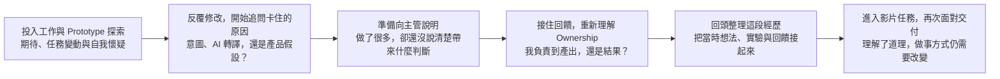

  
PRODUCT EXPLORATION · AI WORKFLOWS · DECISION SYSTEMS

  <h1>Hi, I'm William Chiu</h1>
  
<strong>把模糊問題整理成可驗證的判斷，再把有效方法做成能重複使用的系統。</strong>

  

    我關注產品探索、Agentic Workflow 與 AI 影音， 
    也持續把實作過程沉澱成工具、流程與可以回訪的知識地圖。
  

  

    <code>Product Discovery</code>
    <code>Agentic Workflows</code>
    <code>AI Video</code>
  

  

    <a href="#-projects"><strong>Selected Projects</strong></a>
    ·
    <a href="https://github.com/WilliamCHIU-ETH/ai-video-middle-layer-map"><strong>Latest Research</strong></a>
    ·
    <a href="#我的索引"><strong>My Index</strong></a>
  

---

## 🚀 Projects

| 專案 | 描述 | 技術 |
|------|------|------|
| [ESG RAG Query System](https://github.com/WilliamCHIU-ETH/esg-rag-query-system) | 企業 ESG 報告 RAG 查詢系統，支援自然語言問答 | Python · RAG · LLM |
| [VR Vocational Training](https://github.com/Love-MrHou) | Unity HDRP 建構的職業訓練 VR 系統（畢業專題） | Unity · C# · HDRP |

---

## 我的索引

留給自己回看的職涯紀錄、專案里程碑與學習參考。

### 職涯回顧

一路上，我遇到哪些困惑、收到什麼回饋，又如何重新理解自己的工作。有些想法逐漸清楚，有些問題會在下一個任務裡再次出現。

- [最初的期待與困惑](https://github.com/WilliamCHIU-ETH/ma-program-career-recap) 🔒 Private
- [從局部 Prototype 到完整產品](https://github.com/WilliamCHIU-ETH/3week-mental-map/blob/main/mentalmap.md) · [Intent 到產品之間，誰負責？](https://github.com/WilliamCHIU-ETH/from-intent-to-product)
- [Check-in 會前的意圖與盲點](https://github.com/WilliamCHIU-ETH/check-in_2)
- [Check-in 回饋與後續判斷](https://github.com/WilliamCHIU-ETH/0812_Check-in) · [Ownership：我負責到哪一層](https://github.com/WilliamCHIU-ETH/ownership-recap-checkin2)
- [從 Context Dumping 到 Decision Lock](https://github.com/WilliamCHIU-ETH/dev-diary/blob/main/content/posts/2026-08-14-context-dumping-to-decision-lock.md) 🔒 Private
- [Learning Through Delivery](https://github.com/WilliamCHIU-ETH/learning-through-delivery-2026-08-17-to-23) · [後記：為什麼我會那樣做事](https://github.com/WilliamCHIU-ETH/learning-through-delivery-2026-08-17-to-23/blob/main/REFLECTION-2026-08-24.md)

### 研究與判斷地圖

面對快速變動的領域，我會把零散資訊整理成可以定期回訪、驗證與改判的地圖。

<table>
  <tr>
    <td>
      

        <strong>
          <a href="https://github.com/WilliamCHIU-ETH/ai-video-middle-layer-map">AI 影音中間層地圖｜模型愈強，我該學什麼？</a>
        </strong>
        <code>2026-09-09</code>
      

      

        從 ComfyUI、Higgsfield、LibTV 與 Lumina 的位置變化，追問模型持續吸收生成能力之後，中間層為何仍在分化，以及哪些影音技能值得長期投入、換工具後仍能遷移。
      

      
市場位置 → 模型吸收 → 可遷移技能 → 改判訊號

    </td>
  </tr>
</table>

### 專案與小作品

把實作經驗留下來：有些成為可重用的工具，有些讓我重新理解如何維護一個服務。

#### 把製作經驗變成工具

<table>
  <tr>
    <td>
      

        <strong><a href="https://github.com/WilliamCHIU-ETH/lila-design-system">LILA Design System｜如何讓 Agent 更好地製作 Prototype？</a></strong>
        <code>🔒 Private</code>
      

      
把 UI Token、元件、手機外框與使用契約整理成設計基礎，讓製作 Prototype 的經驗成為 Agent 可以遵循與重用的工具。

      
製作經驗 → 使用契約 → 可重用工具

    </td>
  </tr>
</table>

<table>
  <tr>
    <td>
      
<strong><a href="https://github.com/WilliamCHIU-ETH/morning-brief-workbench">Morning Brief Workbench｜短影音如何反覆交付？</a></strong>

      
從 Marketing Video 經驗提煉稿件規則、範例與品質判準，整理成台股晨報短影音的製作與驗收流程。

      
稿件規則 → 製作流程 → 驗收門檻

    </td>
  </tr>
</table>

<table>
  <tr>
    <td>
      
<strong><a href="https://github.com/WilliamCHIU-ETH/sourced-footage-reel-harness">Sourced Footage Reel｜現成素材怎麼變成一支片？</a></strong>

      
串起文字來源、官方影片素材、選材、剪輯與字幕，保留從素材取得到成片的工序，作為下一次製作可以沿用的方法。

      
來源與素材 → 選材剪輯 → 字幕與成片

    </td>
  </tr>
</table>

#### 讓開發與服務持續運作

<table>
  <tr>
    <td>
      
<strong><a href="https://github.com/WilliamCHIU-ETH/wsl-agent-homebase">WSL Agent Homebase｜閒置筆電能成為 Agent 主機嗎？</a></strong>

      
讓 Windows 筆電承接遠端任務：透過 Discord 下達指令，由 WSL 與 Agent 環境執行，探索既有硬體如何成為工作資源。

      
閒置硬體 → 遠端指令 → Agent 工作環境

    </td>
  </tr>
</table>

<table>
  <tr>
    <td>
      

        <strong><a href="https://github.com/WilliamCHIU-ETH/reliability-engineering-case-study">Reliability Engineering｜API 串好了，為什麼還需要 SQLite？</a></strong>
        <code>案例筆記</code>
      

      
以雪隧哨兵的 SQLite、備份與安全發布為案例，理解從後端功能到服務持續運作之間，多了哪些責任。文章與圖解公開，案例原始碼為私人 repo。

      
串接資料 → 保存狀態 → 理解安全部署與復原

    </td>
  </tr>
</table>

<strong>學習與參考標竿 · 2</strong>

借鏡的作品，不列為自己的製作成果。

- **[MoneyFlow Demo](https://github.com/WilliamCHIU-ETH/moneyflow-demo)** 🔒 Private

  參考資深工程師如何在一天內組織並完成 Prototype。

- **[InvoiceManager Screens](https://github.com/WilliamCHIU-ETH/invoicemanager-screens)** 🔒 Private

  製作 LILA Design System 時的參考，持續對照設計系統與流程能如何改善。

<strong>延伸與回訪 · 2</strong>

- **[ESG RAG｜MCP 延伸](https://github.com/WilliamCHIU-ETH/MCP_ESG_index50)**

  同一 ESG RAG 專案的延伸：透過 MCP 查詢既有報告索引，取得可回查的原文證據。

- **[Tank Simulator](https://github.com/WilliamCHIU-ETH/tank-simulator)**

  回訪坦克自主對戰與遺傳演算法的模擬，觀察環境參數如何影響行為與演化。

